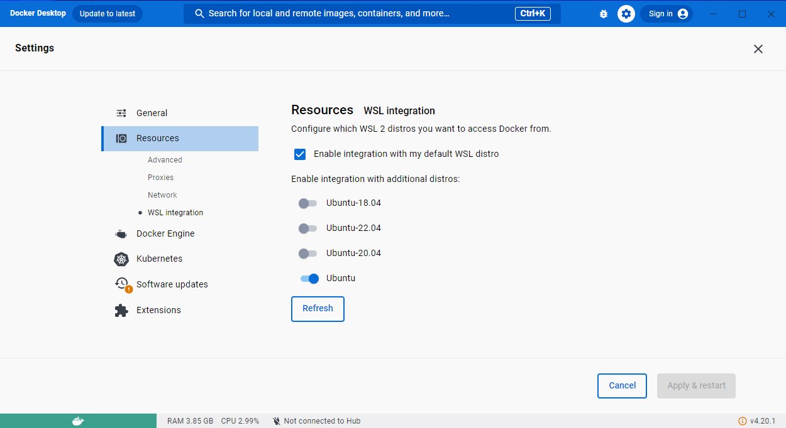
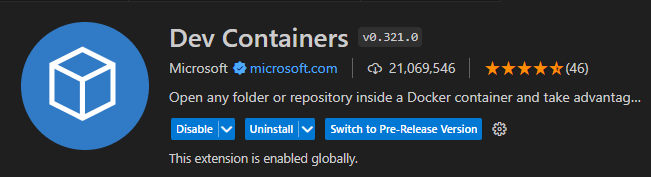
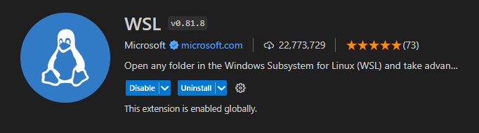
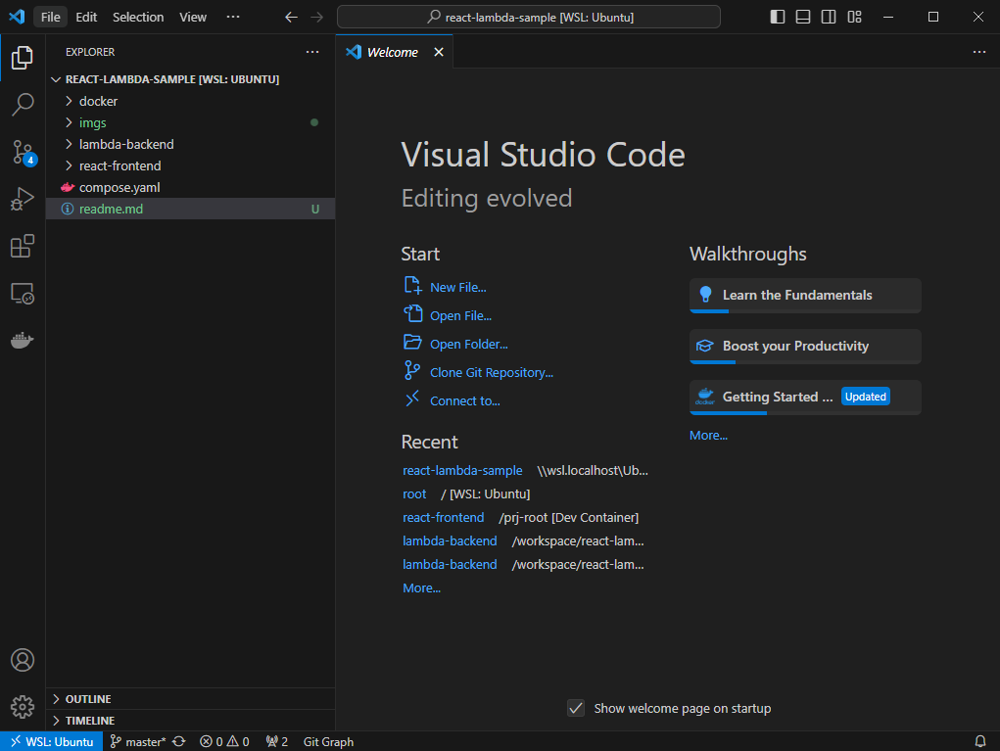
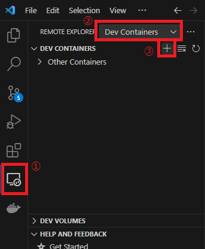
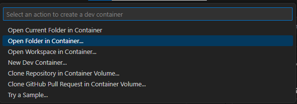
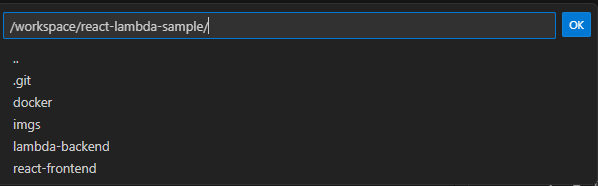
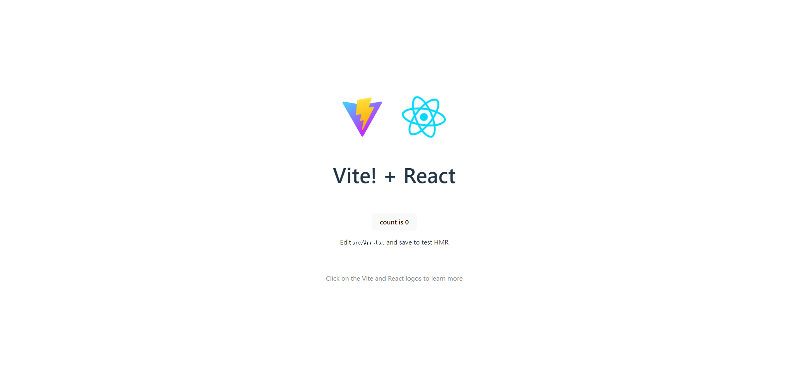
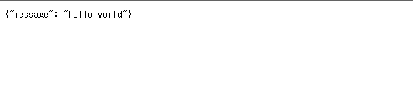

# 1. 環境構築手順

## 1.1. WSLインストール

powershellを管理者で開き、次のコマンドを実行。

```powershell
wsl --install
```

PCを再起動し、インストール完了

## 1.2. Docker Desktop のインストール

1. [Docker Desktop](https://www.docker.com/products/docker-desktop/)からインストーラをダウンロードし、実行する。

2. インストール後、Docker Desktopの設定画面を開き、
*Enable integration with my default WSL distro*をチェックし、*Ubuntu*をONに変更し、**Apply & restart**をクリック



## 1.3. インストール確認

powershellで次のコマンドを実行し、Ubuntuのshellへ

```powershell
wsl -d Ubuntu
> root@2018-PC-036:/mnt/c/Users/mynet36#
```

dockerコマンドが使用できることを確認する。

```bash
docker --version
> Docker version 24.0.2, build cb74dfc
```

バージョンが表示されればOK

## 1.4. VScodeインストール

インストール手順は割愛

次の拡張機能を追加する。





## 1.5. gitリポジトリのクローン

powershellから `wsl -d Ubuntu` を実行し、Ubuntuのshellを起動

任意の作業ディレクトリを作成し、次のコマンドでソースコードをクローンする。

```shell
git clone https://github.com/sakai-mns/react-lambda-sample.git
```

# 2. 開発コンテナの起動

## VScodeでプロジェクトのディレクトリを開く

次のコマンドで、VScodeでクローンしたディレクトリを開く。

```shell
code /path/to/workspace/react-lambda-sample
```

左下に **WSL:Ubuntu** と表示されていることを確認する。



## devcontainer 起動

1. 画面左のタブからリモートエクスプローラーを選択
2. **Dev Containers**を選択
3. **+**ボタンをクリック



**Open Folder in Container**を選択



- フロントの開発環境を起動する場合は、**react-frontend**を選択



フロント起動確認

[http://localhost:15173](http://localhost:15173) にアクセス



- バックエンドの開発環境を起動する場合は**lambda-backend**を選択しOK


バックエンド起動確認

[http://localhost:13000/hello/](http://localhost:13000/hello/) へアクセス

APIレスポンスの `{"message": "hello world"}` がブラウザ上で表示される。


